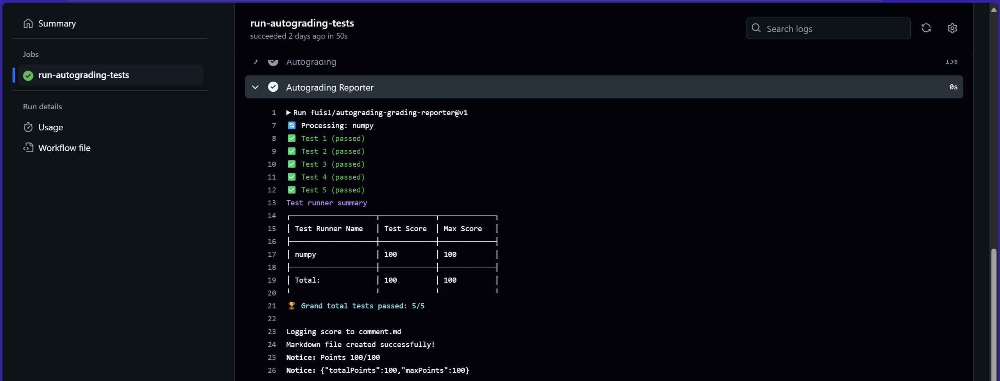
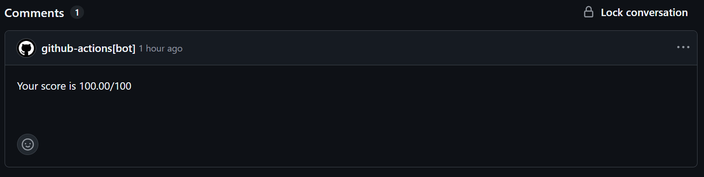

# Lab 3: Pytorch Autograd

In this lab, we will explore Pytorch Autograd functionalities and some of its possible use cases.

> **Note**: You don't have to remove/delete any assertions that are provided in the notebook. You only need to add some code to the code block.
>
> **IMPORTANT: Your code must run without errors before submission to ensure proper evaluation.**
>
> *Other notes are stated in the notebook. Please read them carefully.*

## Overview

When you're reading this, you've probably accepted the assignment. This is your repository for the first assignment with Github Classroom.

You will only have to edit the notebook [`exercises.ipynb`](exercises.ipynb) and submit it. The notebook contains a series of exercises that will test your understanding of the Pytorch Autograd. You will need to complete the exercises and can check with the provided tool.

## Using this notebook

The notebook is structured as a series of code blocks, each containing a function definition with a `raise NotImplementedError` statement. You need to replace this statement with your code to answer the question.

Attempt all questions to get grade evaluated. You must pass all provided assertions before submitting to the autograding system.

## Submission

After completing the notebook, you need to submit your [`exercises.ipynb`](exercises.ipynb) file. You have various way of doing this.

1. You can go directly to your repository and use the upload button to update the file.
2. If you're using Github Codespaces or any other IDE *(code editor)*, you can commit the changes and push to the repository.
    - First you need to clone the repository to your local machine. *(this step is skipped if you're using Codespaces)*
    - Open the terminal and run the following command to clone the repository.

    ```bash
    git clone <repository-url>
    ```

    - After cloning, navigate into the repository directory:

    ```bash
    cd <repository-name>
    ```

    - Make changes to the `exercises.ipynb` file and save.
    - Commit and push your changes following the steps below:

    ```bash
    git add exercises.ipynb
    git commit -m "Completed exercises"
    git push origin main
    ```

    

    > *Checkout [this documentation](https://docs.github.com/en/get-started/start-your-journey/git-and-github-learning-resources) to learn more about Git and Github.*

3. You can view your score by going to the Actions tab in the repository and selecting the latest workflow run. You can see the results of the autograding process.
    

    Or you can checkout the Pull Requests tab to see your grading results.
    